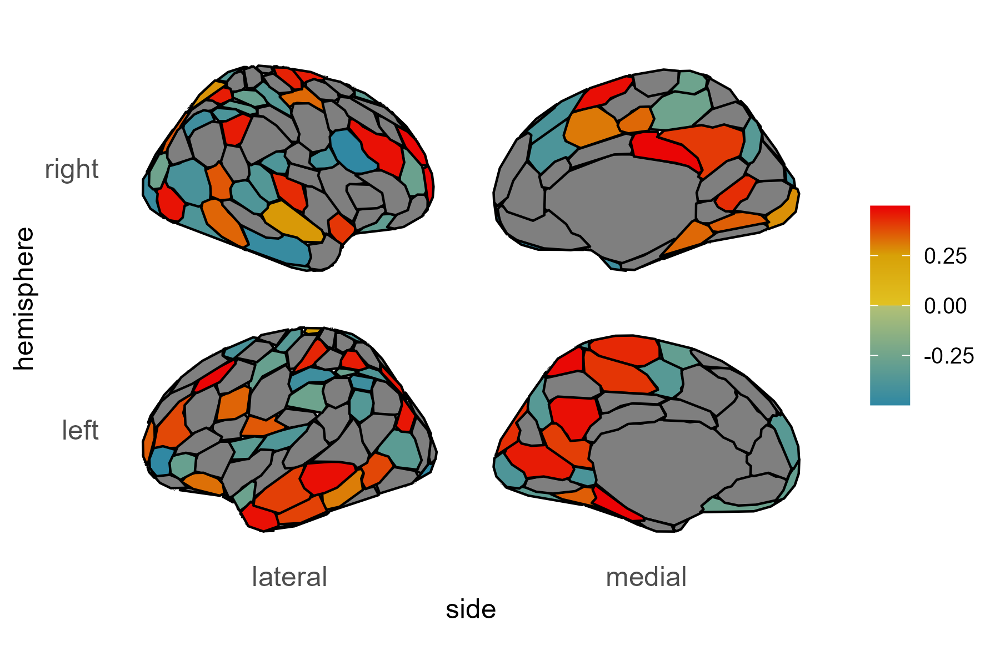
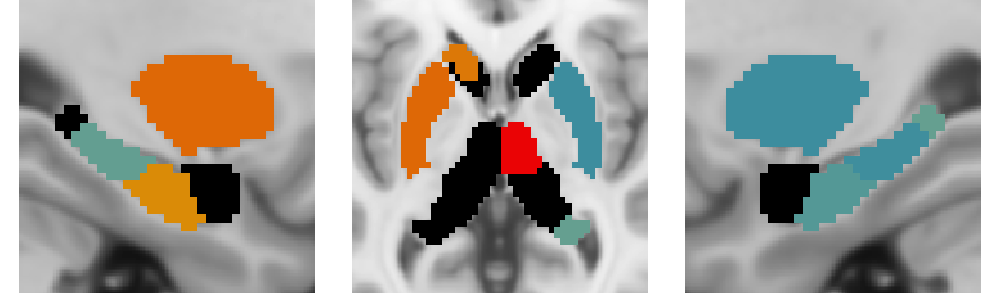

# brainvistools
Python tools for visualizing cortical atlas regions on the brain surface using `ggseg` (calls `R`) and subcortical region axial and sagittal slices using `nilearn` (native `Python`)

Defaults are available to visualize the SchaeferTian 218, 220, 418, and 420 region atlases used for the [tvb-ukbb](https://github.com/McIntosh-Lab/tvb-ukbb) pipeline, but many atlases are available in `ggseg` for the cortex and any atlas can be provided for subcortex visualization. Additional atlases for cortex can be added fairly easily by adding a csv to the data folder with a `region` and `hemi` column (look at `src/data/ST218_Labels.csv` for an example, where the region names need to match what is expected by ggseg), and adding extra cases to the beginning of the `src/data/ggseg_figure.r` script. 

Requirements:
- nibabel, numpy, scipy, pillow, nilearn, and matplotlib are required Python packages
  - tested on Python version 3.10.13 and nibabel=5.2.0, numpy=1.26.2, scipy=1.11.4, pillow=10.0.1, nilearn=0.10.2, and matplotlib=3.8.2 versions
- ggseg, ggsegSchaefer, tidyverse, ggplot2, readxl, dplyr are required R libraries
  - See [here](https://github.com/ggseg/ggsegSchaefer) for ggsegSchaefer install instructions
- This should work on Linux, Mac, and Windows, but has only been tested on Linux

To setup and activate a similar environment using anaconda/miniconda:
```bash
conda create -n brainvistools python=3.10 numpy scipy nibabel nilearn matplotlib pillow
conda activate brainvistools
```

To install:

```bash
git clone https://github.com/McIntosh-Lab/brainvistools.git
cd brainvistools
python -m pip install .
```

There are two main functions here, one for the cortex (`vis_cortex`), and the other for subcortex (`vis_subcortical`). As long as the same threshold is used the colorbar will be equivalent between subcortical and cortical figures.

Example usage:
```python
from brainvistools import visualization
import numpy as np

test_data = np.random.rand((218)) - 0.5

visualization.vis_cortex(test_data,'vis_cortex_218.png',thresh=0.25,atlas_name='ST218')
visualization.vis_subcortical(test_data, 'vis_subcortex_218.png', thresh=0.25, atlas_name='ST218')
```



Other default options can be selected by setting `atlas_name` to one of 'ST218', 'ST220', 'ST418', or 'ST420', or custom atlases can be specified using the options in the functions (`atlas` and `labels` for `vis_cortex` or `atlas_file` and `subcort_regions` for `vis_subcortex`) 
